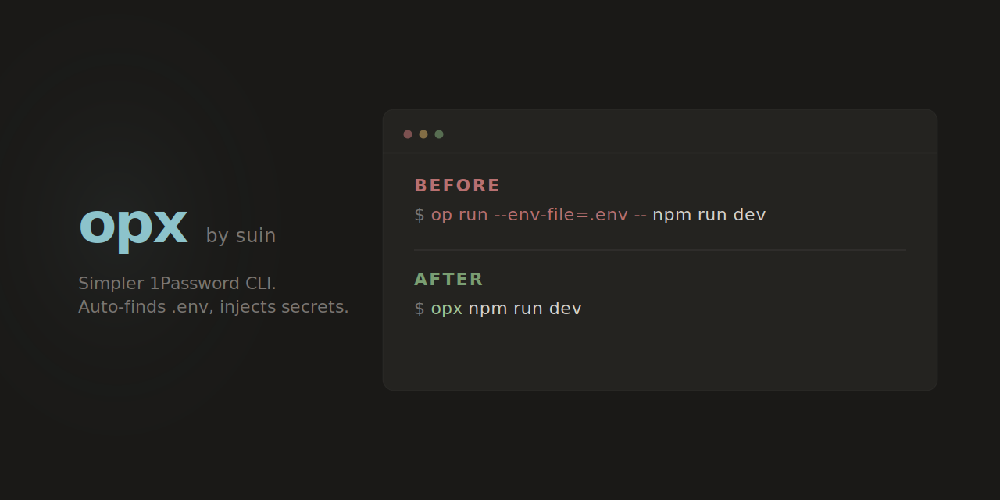

# opx



Thin wrapper around [`op run`](https://developer.1password.com/docs/cli/reference/management-commands/run/) that auto-finds the nearest `.env` file.

## Why

Running `op run --env-file=.env -- <command>` across multiple projects is tedious. `opx` reduces this to:

```sh
opx npm run dev
# equivalent to: op run --env-file=/path/to/.env -- npm run dev
```

## Install

### Bun

```sh
bun add -g @suin/opx
```

### mise

```sh
mise use -g github:suin/opx
```

### curl (standalone binary)

```sh
curl -fsSL https://raw.githubusercontent.com/suin/install/main/install.sh | bash -s -- opx
```

## Usage

```sh
opx <command> [args...]
```

`opx` walks up from the current directory to find the nearest `.env` file, then runs:

```sh
op run --env-file=<found .env path> -- <command> [args...]
```

### Examples

```sh
opx npm run dev
opx node server.js
opx docker compose up
```

### Options

- `--help`, `-h` — Show usage
- `--version` — Show version

## Requirements

- [1Password CLI (`op`)](https://developer.1password.com/docs/cli/get-started/)
